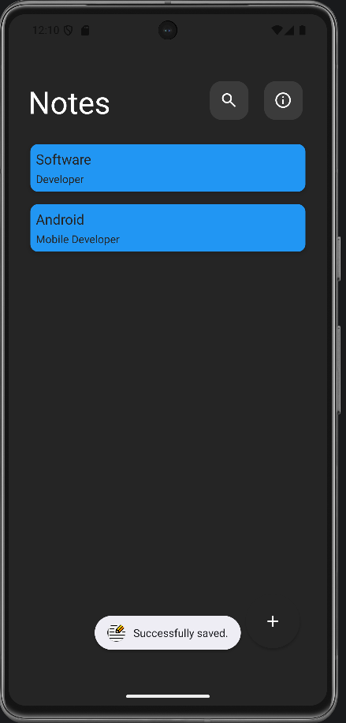
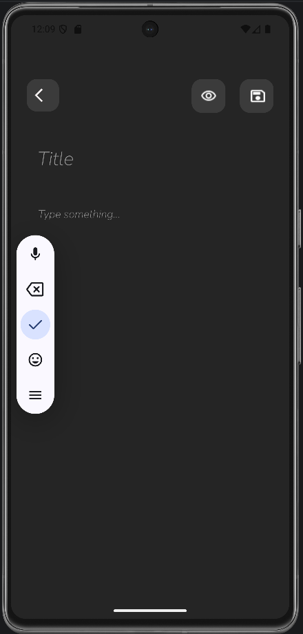

# Notes App Android

A simple Notes application built with **Kotlin**, using **MVVM architecture** and **Room Database**.

## Features

- Create notes
- Edit notes
- Delete notes
- Search notes
- Offline storage with Room Database
- Clean Material Design UI

## Tech Stack

- Kotlin
- MVVM Architecture
- Room Database
- RecyclerView
- ViewBinding
- Material Design

## Screenshots

### Home Screen

### Notes List

### Add Note

### Search

