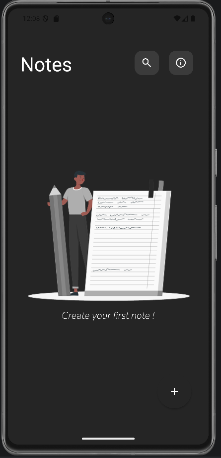
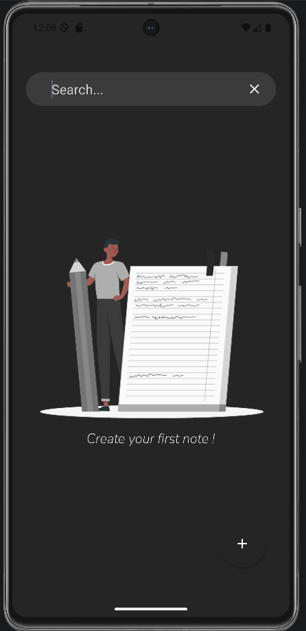

# 📝 Notes App Android

A simple and clean Notes application built with **Kotlin**, following **MVVM architecture** and using **Room Database** for offline storage.

---

## 🚀 Features

* ✏️ Create notes
* 📝 Edit notes
* 🗑️ Delete notes
* 🔍 Search notes
* 💾 Offline storage with Room Database
* 🎨 Clean Material Design UI

---

## 🛠️ Tech Stack

* Kotlin
* MVVM Architecture
* Room Database
* RecyclerView
* ViewBinding
* Material Design

---

## 📱 Screenshots

### Home Screen



### Notes List


### Add Note


### Search



---

## 📚 What I Learned

* Implemented MVVM architecture in a real Android project
* Used Room Database for local data persistence
* Managed UI updates with ViewModel
* Built clean UI using RecyclerView and ViewBinding
* Structured an Android project in a maintainable way

---

## ⚙️ How to Run

1. Clone the repository:

```bash
git clone https://github.com/elgun-agayev/Notes-App-Android.git
```

2. Open the project in Android Studio

3. Build and run the application

---

## 📌 About

This project was created as a learning project to practice Android development concepts and build a clean architecture-based application.

---

## 👨‍💻 Author

**Elgun Agayev**
